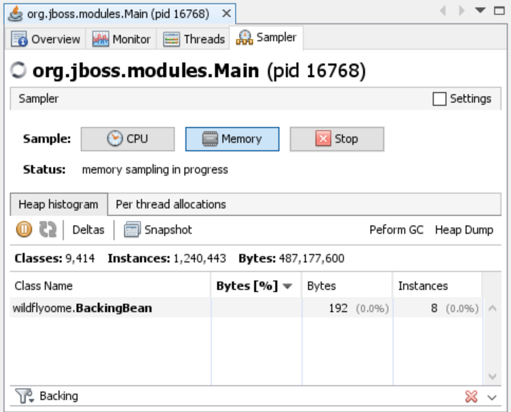

# Huge memory leak in WildFly
The project shows a huge memory leak introduced in recent WildFly versions
that can crash a real-world Java EE application in a matter of hours.

**Affected versions**: 20.0.0.Beta1, 19.1.0.Final, 18.0.1.Final

**Unaffected versions**: 17.0.1.Final

## Steps to reproduce
* Build the project
* Deploy generated WAR file to WildFly
* Execute the bash script
  ```
  for i in {1..10}; do curl http://localhost:8080/wildfly-oome/; done
  ```
* Requests start failing with `java.lang.OutOfMemoryError: Java heap space`

## Analysis
When a JSF page contains any component bound to page variable,
all CDI beans (regardless of scope) used on that page stay in memory.
The image below shows memory after GC.


